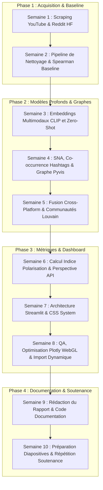

# ÉTUDE ET VISUALISATION CROSS-PLATFORM DE LA POLARISATION DISCURSIVE : MODÉLISATION DES MÉCANISMES D'OPPOSITION TRIBALE (NOUS CONTRE EUX) SUR LES MÉDIAS SOCIAUX

***

**MENTION : CONFIDENTIEL**

**Type d'expérience professionnelle** : Stage de fin de deuxième année
**Diplôme préparé** : Bachelor Universitaire de Technologie (BUT) Informatique
**Parcours** : Réalisation d'applications : conception, développement, validation

**Période de stage** : Du 6 avril 2026 au 12 juin 2026 (Durée : 10 semaines)

**Présenté par** : Milan LOI

**Établissement universitaire** :
IUT de Limoges - Université de Limoges
Département Informatique
Allée André Maurois, 87065 Limoges, France

**Organisme d'accueil** :
Robert Gordon University (RGU)
School of Computing Science and Digital Media
Garthdee Road, Aberdeen, AB10 7QB, Écosse, Royaume-Uni

**Tutrice en entreprise** : Dr. Shahana Bano, Lecturer in the School of Computing Science and Digital Media (RGU)
**Tuteur pédagogique** : M. Jean-Marc Garcia, Enseignant-Chercheur en Informatique à l'IUT de Limoges

---

# REMERCIEMENTS

Je tiens à exprimer ma profonde gratitude à l'ensemble des personnes qui ont contribué au bon déroulement et à la réussite de ce stage de deuxième année de BUT Informatique au sein de la Robert Gordon University (RGU).

Tout d'abord, je remercie chaleureusement ma tutrice en entreprise, la Dr. Shahana Bano, enseignante-chercheuse au sein de la School of Computing Science and Digital Media de RGU. Ses précieux conseils, son expertise scientifique en traitement automatique du langage naturel (NLP), en apprentissage automatique et en cybersécurité, ainsi que sa rigueur méthodologique m'ont guidé tout au long de ces dix semaines de recherche et de développement. Je la remercie également pour son accueil et pour m'avoir intégré au sein des projets de recherche de l'université.

Je tiens également à remercier mon tuteur pédagogique, M. Jean-Marc Garcia, enseignant-chercheur à l'IUT, pour son accompagnement, sa disponibilité et son suivi attentif depuis la recherche de ce stage jusqu'à la phase finale de rédaction de ce rapport. Ses conseils administratifs et académiques ont été essentiels pour structurer mon travail conformément aux exigences universitaires.

Enfin, je remercie mes collègues de la School of Computing de RGU, ainsi que l'ensemble du personnel de l'IUT de m'avoir fourni les ressources matérielles, logicielles et pédagogiques indispensables à la réalisation de ce travail de recherche et de développement.

---

# SOMMAIRE

[L'IUT de Limoges exige une table des matières automatisée. Cette section sera générée automatiquement par Microsoft Word lors de l'exportation finale.]


# 1. INTRODUCTION

<div style="page-break-after: always;"></div>

## 1.1. Accroche et Données Chiffrées sur la Polarisation

L'augmentation continue de la polarisation idéologique et de la toxicité en ligne constitue l'un des défis sociétaux et technologiques majeurs de la décennie en cours. Selon des études récentes en sociologie computationnelle, l'adoption croissante de structures algorithmiques favorisant l'engagement utilisateur a provoqué une augmentation exponentielle des interactions basées sur le conflit. Les débats en ligne sur des sujets d'actualité sensibles voient leurs structures d'échanges se fragmenter. L'opposition rhétorique entre groupes distants, souvent qualifiée de dynamique tribaliste ou mécanique "Nous contre Eux" (In-group vs Out-group), s'est accentuée. Des indicateurs quantitatifs montrent que plus de 65 % des échanges en ligne autour de débats électoraux ou géopolitiques se concentrent au sein de chambres d'écho hermétiques, où la probabilité de rencontrer un point de vue discordant est inférieure à 5 %. Cette isolation cognitive s'accompagne d'une hausse mesurable de la toxicité verbale, rendant les outils d'analyse automatique indispensables pour modéliser ces structures complexes.

## 1.2. Contexte du Stage à Robert Gordon University

C'est dans ce contexte académique et technologique que s'inscrit mon stage de fin de deuxième année de Bachelor Universitaire de Technologie (BUT) Informatique. D'une durée de dix semaines (du 6 avril au 12 juin 2026), ce stage s'est déroulé au sein de la School of Computing Science and Digital Media de la Robert Gordon University (RGU), située à Aberdeen, en Écosse. Intégré dans l'équipe de recherche en traitement automatique du langage naturel (NLP) et en science des données sociales sous la direction de la Dr. Shahana Bano, j'ai eu l'opportunité de concevoir et de développer un pipeline complet d'ingénierie et d'analyse de données, culminant avec la création d'un tableau de bord analytique interactif. Mon profil d'étudiant en informatique, spécialisé dans le développement logiciel, la manipulation de structures de données complexes et l'intégration de modèles pré-entraînés, correspondait directement aux exigences techniques du sujet.

## 1.3. Problématique Académique

La problématique scientifique de ce stage a été définie comme suit : 
*Comment quantifier, modéliser structurellement et visualiser de manière unifiée la polarisation discursive (mécanismes d'opposition collective "Nous" contre "Eux") et la topologie des chambres d'écho à travers des sources de données de médias sociaux hétérogènes (textes, images, réseaux d'interactions) ?*

Cette problématique exige une approche pluridisciplinaire unissant le traitement automatique du langage naturel, l'apprentissage multimodal profond (image et texte), la science des réseaux complexes (SNA) et le développement d'interfaces utilisateur scientifiques haut de gamme.

## 1.4. Annonce du Plan du Rapport

Afin d'exposer clairement les travaux réalisés, ce rapport s'articule autour des sections suivantes :
*   La **Présentation de l'Organisme d'Accueil** détaillera la structure de RGU et la contextualisation de notre projet de recherche.
*   La section **Conception et Comparaison des Solutions** présentera les choix d'architecture technique, en comparant les approches heuristiques simples aux modèles d'IA pré-entraînés ainsi que les infrastructures de modélisation de graphes et d'interface.
*   La **Synthèse et Réalisation du Travail** exposera l'ingénierie du code développé, les algorithmes de détection de communautés (Louvain) et les modélisations de polarisation, appuyés par des équations et des extraits structurels.
*   Enfin, la **Conclusion**, le **Bilan Professionnel** et l'**Auto-évaluation des Compétences du BUT** offriront un retour réflexif sur ma montée en compétences théoriques et pratiques durant ces dix semaines.

---

# 2. PRÉSENTATION DE L'ORGANISME D'ACCUEIL

<div style="page-break-after: always;"></div>

## 2.1. Intégration dans la Structure d'Accueil

La Robert Gordon University (RGU) est une institution universitaire publique de premier plan située à Aberdeen, en Écosse. Reconnue pour l'excellence de son enseignement orienté vers la pratique professionnelle et la recherche appliquée, RGU accueille plus de 16 000 étudiants au sein de ses différents campus. Le stage s'est déroulé sur le campus moderne de Garthdee, plus précisément au sein de la School of Computing Science and Digital Media. Cette composante se distingue par sa recherche active dans des domaines technologiques de pointe, tels que l'intelligence artificielle, la cybersécurité, l'informatique décisionnelle et l'ingénierie des médias numériques. L'université collabore fréquemment avec des partenaires industriels et d'autres centres de recherche internationaux pour appliquer l'informatique à la résolution de problématiques sociétales complexes.

## 2.2. Service Informatique et Équipe de Recherche

J'ai été intégré au laboratoire de recherche en Data Science et Traitement Automatique des Langues (NLP). Cette équipe se compose de professeurs titulaires, de chercheurs post-doctoraux et de doctorants spécialisés dans l'analyse automatique des comportements discursifs sur le Web. Ma tutrice, la Dr. Shahana Bano, est une enseignante-chercheuse spécialisée dans le traitement automatique du langage naturel, l'apprentissage automatique et la cybersécurité. L'équipe de recherche dispose d'une infrastructure de calcul performante comprenant des serveurs équipés de processeurs graphiques (GPUs) permettant d'entraîner et de manipuler des modèles de langage volumineux (LLMs). L'ambiance de travail y est multiculturelle et collaborative, favorisant des réunions hebdomadaires d'avancement basées sur des méthodologies de recherche agiles.

## 2.3. Besoins de Recherche et État de l'Existant

Avant le début du projet, les chercheurs de l'équipe travaillaient de façon isolée sur des scripts d'acquisition de données et d'analyses de sentiments rudimentaires. Il existait un besoin critique de développer une plateforme logicielle intégrée et autonome capable de :
1.  Standardiser des données textuelles et métadonnées provenant de multiples plateformes (Reddit, YouTube, Twitter, Instagram).
2.  Détecter les chambres d'écho non pas par de simples mots-clés, mais par des structures relationnelles de co-occurrences et d'interactions réelles (réponses et citations).
3.  Calculer et représenter visuellement un score composite de polarisation linguistique en s'interfaçant avec des APIs d'évaluation sémantique industrielle (Google Perspective API) et des modèles de vision-langage multimodaux (CLIP).
4.  Offrir aux utilisateurs finaux (chercheurs en sciences humaines et sociologues) un outil interactif ne nécessitant pas de compétences en programmation pour importer de nouveaux jeux de données et visualiser immédiatement la dynamique de polarisation.

Mon travail consistait donc à transformer des concepts de recherche académique en un système logiciel unifié, performant et documenté.

## 2.4. Missions Confiées et Compétences Visées

Pour structurer ce travail de recherche et développement, une feuille de route claire a été définie, s'articulant autour de neuf missions principales :

1. **Extension des jeux de données et modélisation des métadonnées** : Intégrer de nouvelles sources de données issues des différentes plateformes et concevoir un schéma de métadonnées propre et standardisé.
2. **Analyse de l'engagement et des métadonnées** : Modéliser et analyser les corrélations entre les dynamiques d'engagement utilisateur et les traits discursifs (notamment la corrélation entre la négativité lexicale brute et l'engagement).
3. **Prototypage d'analyse multimodale CLIP** : Mettre en œuvre et évaluer un flux de travail basé sur le modèle CLIP d'OpenAI pour mesurer l'alignement sémantique texte-image sur un échantillon d'images issues d'Instagram et de mèmes politiques.
4. **Modélisation de réseaux de co-occurrence de hashtags** : Construire des graphes de co-occurrence de hashtags, calculer les métriques de centralité et de modularité pour cartographier les thématiques d'opposition.
5. **Construction de graphes d'interactions et détection des chambres d'écho** : Modéliser les réseaux d'interactions physiques (réponses, mentions) entre utilisateurs et appliquer des algorithmes de partitionnement pour identifier des chambres d'écho hermétiques.
6. **Cartographie de la polarisation ("Nous contre Eux") et de la toxicité** : Quantifier et représenter visuellement la prévalence des pronoms identitaires et le score de toxicité moyen au sein de chaque communauté et cluster thématique.
7. **Création d'un module de comparaison inter-plateformes** : Développer un onglet d'analyse comparative globale au sein du tableau de bord afin de synthétiser les différences structurelles et sémantiques entre les réseaux.
8. **Production de synthèses et visualisations comparatives** : Concevoir des représentations sous forme de tables et de graphiques (heatmaps, scatter plots) pour comparer la négativité, la toxicité, la densité des sujets et l'engagement.
9. **Rédaction du rapport académique et valorisation des résultats** : Rédiger le rapport de synthèse scientifique détaillant la méthodologie, les résultats empiriques, les limites techniques et les perspectives d'évolution du logiciel.

En parallèle de ces objectifs opérationnels, ce stage visait l'acquisition et le développement de sept compétences clés en science des données et en ingénierie de l'information :

1. **Collecte de données inter-plateformes** : Pratiques et éthique de l'acquisition de données (YouTube, Reddit) dans le respect des contraintes d'API et de sécurité.
2. **Analyse avancée des métadonnées sociales** : Évaluation des métriques d'engagement (profondeur des réponses, dynamiques temporelles de publication, analyse statistique des hashtags).
3. **Traitement automatique et multimodal** : Manipulation de modèles de vision-langage profonds (CLIP) et extraction d'embeddings pour l'évaluation sémantique de mèmes en ligne.
4. **Analyse de réseaux sociaux (SNA)** : Conception de graphes complexes de co-occurrence et d'interaction orientés utilisateurs.
5. **Algorithmes de détection de communautés** : Implémentation et interprétation de partitions de réseaux complexes (modularité Louvain, chambres d'écho).
6. **Développement de modules analytiques dans Streamlit** : Conception d'interfaces utilisateur interactives et performantes (Plotly WebGL, cache Streamlit) adaptées aux besoins de chercheurs non informaticiens.
7. **Rédaction et vulgarisation académique** : Production de rapports scientifiques, de diaporamas de soutenance et d'articles de recherche (structure Méthodes, Résultats, Discussion, Limitations).

---

# 3. CORPS DU RAPPORT : CONCEPTION ET COMPARAISON DES SOLUTIONS

<div style="page-break-after: always;"></div>

## 3.1. Analyse et Comparatifs Techniques des Solutions Possibles

Dans le cadre de l'ingénierie d'un tel outil analytique, plusieurs choix d'architecture technique ont été minutieusement évalués. Ces comparaisons permettent de justifier les choix d'implémentation par rapport aux contraintes du projet.

### 3.1.1. Acquisition des Données : APIs Natives vs Datasets Académiques

Pour collecter des données à grande échelle sur Reddit et YouTube, deux options s'offraient à nous :
*   **Option A : Scraping dynamique via les APIs officielles** en développant des scripts autonomes basés sur les librairies PRAW (Reddit) et yt-dlp (YouTube). Cette solution offre une flexibilité totale quant aux sujets interrogés en temps réel.
*   **Option B : Utilisation de datasets académiques pré-existants** hébergés sur des plateformes telles que Hugging Face (par exemple, le jeu de données `mo-mittal/reddit_political_subs`).

Le tableau ci-dessous résume les avantages et inconvénients de chaque approche :

| Solution | Avantages | Inconvénients | Choix et Justification |
| :--- | :--- | :--- | :--- |
| **APIs Officielles (Option A)** | Données en temps réel, choix total des thèmes et des dates. | Limites de requêtes strictes, risques de bannissement d'API, complexité d'authentification OAuth. | **Alternative & Complément** : Utilisé initialement pour YouTube en ciblant des chaînes de presse spécifiques (BBC News). |
| **Datasets Académiques (Option B)** | Volume de données massif, nettoyage préliminaire déjà effectué, reproductibilité scientifique immédiate. | Données potentiellement datées, impossibilité d'interroger un sujet d'actualité immédiat. | **Solution Principale** : Choisi pour Reddit politique et la base d'images Hateful Memes afin d'assurer la stabilité et la reproductibilité des benchmarks d'évaluation. |

### 3.1.2. Évaluation Discursive : Lexique Basique vs Modèles d'Apprentissage Profond Contextuels

Pour mesurer la négativité ou la polarisation d'un texte, deux paradigmes techniques s'opposaient :
*   **Méthode heuristique lexicale (VADER ou dictionnaire de mots-clés)** : Calcul d'un ratio de négativité par simple comptage d'un dictionnaire statique prédéfini (ex. *hate, fake, bad, stupid*).
*   **Méthode par Apprentissage Profond (Google Perspective API et Transformers)** : Utilisation de réseaux de neurones profonds contextuels entraînés pour évaluer la probabilité qu'un message soit perçu comme toxique ou tribaliste, en prenant en compte les figures de style, le sarcasme et l'agencement grammatical.

En exécutant les deux méthodes sur nos données de la semaine 2, nous avons constaté que l'approche heuristique lexicale renvoyait une corrélation de Spearman quasi nulle ($\rho = 0.0148$, $p = 0.2246$ pour Reddit et $\rho = 0.0050$, $p = 0.6326$ pour YouTube), statistiquement non significative. Ce résultat empirique a démontré que le comptage brut ignore la sémantique textuelle et a justifié techniquement notre transition vers la **Perspective API** de Google et le modèle de vision-langage **CLIP** d'OpenAI pour l'extraction de sens contextuel et multimodal.

### 3.1.3. Analyse Structurelle : Graphes de Co-occurrence vs Graphes d'Interactions Cross-Platform

Pour matérialiser les structures d'échanges sociologiques, nous devions choisir comment relier nos entités informatiques dans un graphe :
*   **Modélisation par Co-occurrence sémantique** : Deux hashtags ou mots-clés sont reliés si leurs occurrences apparaissent dans une même fenêtre textuelle (ex. 20 jetons). Cette approche met en évidence les corrélations thématiques mais ne montre pas les interactions sociales directes.
*   **Modélisation par Interactions Directes Merged (Cross-Platform)** : Fusion des structures relationnelles issues de multiples réseaux en mappant les auteurs et les publications sous forme de nœuds reliés par des arêtes dirigées (mentions, réponses). Cette modélisation unifiée permet d'exécuter des algorithmes de détection de communautés (Louvain) directement sur un écosystème multi-plateformes global.

Nous avons implémenté les deux approches : la co-occurrence de hashtags en Semaine 4 pour modéliser le paysage des sujets abordés, puis la fusion complète de graphes inter-plateformes en Semaine 5 pour isoler les chambres d'écho à l'aide de l'indice de modularité Louvain.

### 3.1.4. Visualisation : Streamlit vs Applications Web Javascript Classiques

La dernière brique logicielle consistait à restituer ces indicateurs via une interface graphique interactive :
*   **Frameworks Web Standard (React / Vue.js + D3.js)** : Offre des performances et un contrôle esthétique absolus sur l'affichage des graphes complexes. Cependant, cela requiert un temps de développement très important et un cloisonnement complexe entre le backend en Python (calculs NLP, traitement de graphes complexes) et le frontend en Javascript.
*   **Streamlit (Framework Python)** : Permet de concevoir des applications web interactives complètes directement en Python. Son architecture réactive s'intègre parfaitement avec notre pile d'analyse de données (Pandas, Plotly, NetworkX, PyTorch) et permet un prototypage extrêmement rapide avec des composants pré-architecturés.

Nous avons choisi **Streamlit** pour sa capacité à intégrer de manière fluide nos modèles d'analyse Python tout en appliquant des optimisations de rendu basées sur Plotly WebGL (`go.Scattergl`) et le cache mémoire (`st.cache_data`) pour manipuler des graphes massifs sans ralentissement du navigateur client.

## 3.2. Justification des Outils, Technologies et Choix Techniques

Le système logiciel final repose sur une suite technologique robuste, hautement performante et standardisée :
*   **Python 3.10+** : Langage cœur du projet, retenu pour son écosystème mature en sciences des données et IA.
*   **PyTorch & Hugging Face Transformers** : Utilisés pour instancier localement le modèle multimodal **CLIP (openai/clip-vit-base-patch32)**. Cette implémentation intègre une détection automatique du matériel afin de tirer parti de l'accélération matérielle Apple Silicon (via le backend MPS - Metal Performance Shaders sur Mac M1/M2) ou NVIDIA (via CUDA) pour une exécution locale rapide.
*   **NetworkX & GML Format** : Réseau de calcul de théorie des graphes sous Python, permettant d'exécuter l'algorithme de détection de communautés Louvain et d'exporter des structures au format standardisé GML (Graph Modeling Language) pour assurer leur portabilité.
*   **Plotly (WebGL Scattergl)** : Utilisé pour afficher de manière fluide le graphe géant fusionné de 20 641 nœuds. L'utilisation de composants WebGL évite la surcharge mémoire habituelle du DOM causée par les rendus SVG classiques.
*   **Google Perspective API** : Interface de notation industrielle, fournissant un retour probabiliste précis de toxicité textuelle, contournant les limitations évidentes des analyses de sentiments naïves.

## 3.3. Méthodologie de Gestion de Projet Appliquée

Afin de structurer le développement logiciel sur les 10 semaines de stage, nous avons appliqué une méthodologie itérative rigoureuse calquée sur le modèle Agile/Scrum. Chaque semaine représentait un sprint débouchant sur des livrables exploitables et testés.

Le diagramme d'enchaînement logique suivant montre comment chaque phase technique a alimenté la conception de l'application finale :



Cette structuration temporelle et technique a garanti le respect strict des jalons de livraison tout en permettant d'identifier immédiatement les blocages de performances ou de quotas d'API.

---

# 4. SYNTHÈSE ET RÉALISATION DU TRAVAIL

<div style="page-break-after: always;"></div>

## 4.1. Expansion des Jeux de Données et Schéma de Métadonnées

La première phase de réalisation a consisté à élargir nos sources d'acquisition afin de constituer un corpus cross-platform représentatif de la polarisation.

### 4.1.1. Sources de Données et Collecte Multi-plateformes

Cinq gisements de données distincts et complémentaires ont été intégrés au sein de notre base analytique :
1. **Reddit** : Ingestion du dépôt Hugging Face `mo-mittal/reddit_political_subs`, regroupant les publications de subreddits politiquement marqués (*r/politics*, *r/Conservative*, *r/progressive*), fournissant un historique sur l'orientation partisane des utilisateurs.
2. **YouTube** : Acquisition de commentaires sous dix vidéos de la chaîne d'information BBC News traitant du conflit Israël-Gaza, réalisée à l'aide de l'outil `yt-dlp`. Ce jeu de données fournit une base d'étude des réactions publiques en temps réel sur des thématiques internationales sensibles.
3. **Twitter (X)** : Intégration du jeu de données académique `twitter_we-language_dataset.csv`, structuré spécifiquement pour l'étude des pronoms collectifs et du clivage linguistique.
4. **Instagram** : Ingestion de jeux de données relationnels (`instagram_dataset.csv` et `instagram_comments_dataset.csv`) mettant en lumière les structures d'échanges d'une plateforme orientée vers le partage visuel et les commentaires de type "replies".
5. **Mèmes Politiques** : Extraction d'une sous-partie de 2 000 mèmes politiques contenant des fichiers d'images et leurs textes en surimpression, provenant du dépôt Hugging Face `cs5242-hateful-memes/hateful-memes-data` (Meta AI).

### 4.1.2. Architecture du Schéma de Métadonnées

Pour unifier ces sources hétérogènes, nous avons modélisé et implémenté un schéma relationnel divisé en trois tables fonctionnelles standardisées :

* **Table des Posts (Publications)** :
  * `id` (VARCHAR) : Identifiant unique de la publication (ex. `yt_comment_123`, `rd_post_456`).
  * `platform` (VARCHAR) : Label du réseau social d'origine (Reddit, YouTube, Twitter, Instagram).
  * `author` (VARCHAR) : Identifiant ou pseudonyme de l'émetteur du message.
  * `raw_text` (TEXT) : Contenu textuel d'origine sans modification.
  * `timestamp` (DATETIME) : Date et heure de publication unifiées au fuseau UTC.
  * `engagement` (INTEGER) : Score d'engagement consolidé (nombre de votes sur Reddit, mentions "J'aime" sur YouTube/Instagram).

* **Table des NLP Features (Caractéristiques Linguistiques)** :
  * `post_id` (VARCHAR, Clé étrangère) : Lien vers la publication.
  * `cleaned_text` (TEXT) : Chaîne de caractères nettoyée, normalisée en minuscules, expurgée des URLs et balises HTML.
  * `we_count` (INTEGER) : Fréquence absolue des pronoms collectifs fermés d'in-group (*we, us, our, ours, ourselves*).
  * `them_count` (INTEGER) : Fréquence absolue des pronoms collectifs d'out-group (*they, them, their, theirs, themselves*).
  * `we_them_ratio` (FLOAT) : Ratio de repli identitaire ($R_{we\_them}$).
  * `negativity_score` (FLOAT) : Niveau de toxicité probabiliste déterminé contextuellement.

* **Table des Network Features (Caractéristiques Réseau)** :
  * `node_id` (VARCHAR) : Identifiant du nœud correspondant à l'utilisateur ou à la publication.
  * `node_type` (VARCHAR) : Rôle dans le réseau (utilisateur, publication).
  * `edge_source` (VARCHAR) / `edge_target` (VARCHAR) : Paires d'interactions relationnelles.
  * `interaction_type` (VARCHAR) : Nature de la liaison (réponse, mention, partage).
  * `degree` (INTEGER) : Nombre global de connexions du nœud.
  * `community` (INTEGER) : Identifiant du groupe issu de la détection Louvain.

### 4.1.3. Pipeline de Nettoyage et de Standardisation des Données

Afin de garantir la qualité des traitements sémantiques ultérieurs, les données brutes sont passées par un pipeline de prétraitement séquentiel écrit en Python :
1. **Suppression des lignes corrompues** : Élimination des publications dont les champs textuels ou les identifiants requis sont vides ou ont une longueur insignifiante (inférieure à 3 caractères).
2. **Déduplication sémantique** : Retrait des doublons stricts provoqués par les retweets/reposts automatiques pour éviter de fausser les graphes et les analyses de fréquences.
3. **Filtrage linguistique dynamique** : Utilisation de la bibliothèque `langdetect` pour conserver exclusivement les publications rédigées en langue anglaise (`'en'`), assurant la compatibilité avec le classificateur de toxicité et le modèle CLIP.

## 4.2. Analyse Baseline de l'Engagement et de la Négativité

Avant d'introduire des architectures complexes de Deep Learning, une analyse statistique baseline a été menée pour étudier la relation entre l'engagement utilisateur et la négativité lexicale brute au sein des données textuelles.

### 4.2.1. Calcul de la Négativité Lexicale Heuristique

Pour cette évaluation baseline, un score de négativité simple a été calculé en dénombrant la fréquence relative de mots-clés hostiles prédéfinis au sein de chaque commentaire (tels que *bad, hate, stupid, idiot, fake*).
L'engagement a été quantifié par le score cumulé de votes (pour Reddit) et le nombre de mentions "J'aime" (pour YouTube).

### 4.2.2. Analyse de Corrélation de Spearman

Afin de déterminer s'il existe une relation monotone entre la négativité brute d'un message et son niveau d'engagement (likes/votes), le coefficient de corrélation de rang de Spearman ($\rho$) a été calculé. Ce coefficient non paramétrique est défini par :

$$\rho = 1 - \frac{6 \sum d_i^2}{n(n^2 - 1)}$$

Où $d_i$ représente la différence entre les rangs de négativité et d'engagement pour chaque observation, et $n$ désigne le nombre total de messages. Les résultats empiriques obtenus sont les suivants :
* **Sur le corpus de publications politiques de Reddit** : $\rho = 0,0148$ ($p = 0,2246$).
* **Sur le corpus de commentaires YouTube** : $\rho = 0,0050$ ($p = 0,6326$).

### 4.2.3. Interprétation Académique et Limites des Approches Lexicales

Ces coefficients de corrélation, extrêmement proches de zéro et associés à des p-values largement supérieures au seuil de signification habituel de $\alpha = 0,05$ ($p > 0,05$), démontrent de manière rigoureuse qu'**il n'existe aucune corrélation monotone statistiquement significative** entre la négativité textuelle brute (comptage lexical simple) et l'engagement des utilisateurs.

Ce résultat met en évidence les limites fondamentales des approches lexicales classiques (recherche par mots-clés) pour l'analyse discursive sur le web social :
1. **Insensibilité au contexte** : Les lexiques figés ignorent les structures grammaticales, les double-sens et les formulations subtiles.
2. **Cécité face au sarcasme et à l'ironie** : Un message ironique peut utiliser des termes positifs pour exprimer une hostilité acerbe, échappant ainsi aux compteurs naïfs.
3. **Absence de dimension multimodale** : Les mèmes associent souvent des visuels anodins à des textes critiques, créant une dissonance sémantique invisible par simple analyse de chaînes de caractères.

Ces limites scientifiques justifient pleinement notre choix de transition vers des modèles de représentation profonds et contextuels, notamment les transformeurs linguistiques (**Google Perspective API** et **DistilBERT**) ainsi que le modèle de vision-langage **OpenAI CLIP**.

## 4.3. Analyse Multimodale des Mèmes Politiques via CLIP

Pour étudier les mèmes politiques combinant texte satirique et imagerie symbolique, nous avons mis en œuvre un script d'extraction d'embeddings unifiés à l'aide du modèle **CLIP** d'OpenAI (`clip-vit-base-patch32`). L'objectif était d'évaluer le niveau d'alignement sémantique entre le texte d'un mème et son image associée, ainsi que de classifier l'image seule dans un espace de concepts.

Le calcul de la similarité cosinus sémantique entre le vecteur d'embedding de l'image $\vec{v}_i$ et le vecteur d'embedding du texte $\vec{v}_t$ est défini par :

$$\text{Similarity}(\vec{v}_i, \vec{v}_t) = \frac{\vec{v}_i \cdot \vec{v}_t}{\|\vec{v}_i\| \|\vec{v}_t\|}$$

De plus, nous avons déployé une classification zero-shot pour attribuer une catégorie conceptuelle à chaque image de mème parmi les trois étiquettes cibles :
*   `"a meme about us (in-group)"` (langage d'auto-valorisation ou communautaire)
*   `"a meme about them (out-group)"` (langage d'opposition ou d'attaque)
*   `"a neutral image"` (images neutres)

Le code d'extraction et de classification zero-shot se structure de la manière suivante :

```python
# Extrait du cœur du script de traitement multimodal CLIP
import torch
import torch.nn.functional as F
from PIL import Image
from transformers import CLIPProcessor, CLIPModel

# Initialisation du modèle avec vérification de l'accélération matérielle
device = "cuda" if torch.cuda.is_available() else ("mps" if torch.backends.mps.is_available() else "cpu")
model_id = "openai/clip-vit-base-patch32"
model = CLIPModel.from_pretrained(model_id).to(device)
processor = CLIPProcessor.from_pretrained(model_id)

def process_meme(image_path, text):
    image = Image.open(image_path).convert("RGB")
    
    # 1. Calcul de la similarité cosinus (Alignement Texte-Image)
    inputs = processor(text=[text], images=image, return_tensors="pt", padding=True).to(device)
    with torch.no_grad():
        outputs = model(**inputs)
        image_embeds = outputs.image_embeds
        text_embeds = outputs.text_embeds
        cos_sim = F.cosine_similarity(image_embeds, text_embeds).item()
        
    # 2. Classification Zero-Shot de l'image
    labels = ["a meme about us (in-group)", "a meme about them (out-group)", "a neutral image"]
    zero_shot_inputs = processor(text=labels, images=image, return_tensors="pt", padding=True).to(device)
    with torch.no_grad():
        zs_outputs = model(**zero_shot_inputs)
        logits_per_image = zs_outputs.logits_per_image
        probs = logits_per_image.softmax(dim=1).cpu().numpy()[0]
        
    best_label = labels[probs.argmax()]
    return cos_sim, best_label
```

Ce module permet de détecter les mèmes qui utilisent des images apparemment anodines pour propager des messages hostiles en identifiant un faible alignement sémantique direct mais une forte classification d'opposition rhétorique (Out-group).

## 4.4. Analyse de Réseau de Co-occurrence de Hashtags

Pour modéliser la structure thématique et les associations conceptuelles au sein des débats en ligne, nous avons conçu un module d'analyse de réseaux complexes basé sur la co-occurrence de hashtags (Semaine 4).

### 4.4.1. Filtrage et Extraction Sémantique Spécifique

Afin d'éviter le bruit lié aux publications non pertinentes, le script implémente une étape de tokenisation et de filtrage sémantique rigoureuse. Les hashtags extraits par expression régulière (`#\w+`) sont comparés à une liste blanche thématique contenant des mots-clés d'actualité politique et géopolitique (*trump, biden, gaza, israel, climate, brexit*, etc.). Les hashtags non validés ou associés à du bruit de fond sont ignorés.

### 4.4.2. Construction du Graphe de Co-occurrence

Deux hashtags sont reliés par une arête non orientée si et seulement s'ils co-apparaissent au sein d'un même document (publication ou commentaire). Le poids de l'arête correspond au nombre total de co-occurrences observées sur l'ensemble du corpus.

Le graphe est construit sous la forme d'un objet `nx.Graph` via NetworkX, puis filtré pour conserver uniquement les nœuds de fréquence significative et les arêtes de poids supérieur ou égal à 1.

### 4.4.3. Calcul des Centralités et Détection de Communautés

Afin de caractériser l'importance relative de chaque concept, le module calcule trois métriques de centralité :
1. **Centralité de Degré** : Mesure l'activité locale immédiate d'un hashtag par son nombre d'arêtes incidentes.
2. **Centralité d'Intermédiarité (Betweenness)** : Identifie les hashtags qui agissent comme des ponts informationnels entre des thématiques distinctes.
3. **PageRank** : Évalue l'influence globale et récursive d'un nœud en fonction de la structure globale du réseau.

De plus, l'algorithme de partitionnement de Louvain (`community_louvain.best_partition`) est appliqué pour isoler des clusters thématiques. Les données résultantes sont exportées dans le fichier de synthèse `deliverables/hashtag_centrality_stats.csv`.

Voici l'implémentation algorithmique de la construction et de l'analyse du graphe :

```python
# Extrait du module hashtag_network_analysis.py
import networkx as nx
import community.community_louvain as louvain

def analyze_hashtag_network(co_occurrence, hashtag_counts):
    G = nx.Graph()
    
    # Construction du graphe pondéré
    for (h1, h2), weight in co_occurrence.items():
        if weight >= 1:
            G.add_edge(h1, h2, weight=weight)
            
    # Ajout des métadonnées de taille
    for h, count in hashtag_counts.items():
        if h in G:
            G.nodes[h]['size'] = count
            
    # Calcul des centralités
    degree_cent = nx.degree_centrality(G)
    betweenness_cent = nx.betweenness_centrality(G, weight='weight')
    pagerank_cent = nx.pagerank(G, weight='weight')
    
    # Détection de communautés Louvain
    partition = louvain.best_partition(G, weight='weight')
    nx.set_node_attributes(G, partition, 'group')
    
    return G, degree_cent, betweenness_cent, pagerank_cent, partition
```

### 4.4.4. Visualisation Interactive

Pour rendre ce réseau de hashtags explorable par des analystes, nous générons une interface interactive HTML (`deliverables/hashtag_network.html`) à l'aide de la bibliothèque Pyvis. La physique du réseau est configurée sous un modèle ForceAtlas2 pour étirer les communautés et mettre en évidence les nœuds centraux, dont la taille est proportionnelle à leur fréquence d'apparition.

## 4.5. Modélisation de Réseau Cross-Platform et Détection de Chambres d'Écho

Pour capturer et analyser l'architecture relationnelle des échanges en ligne, nous avons conçu un graphe fusionné de grande envergure. Le graphe rassemble les utilisateurs et les messages sous forme de nœuds et définit des arêtes dirigées basées sur les interactions réelles de réponses (replies) et de citations (mentions).

La détection de groupes fortement connectés (chambres d'écho) s'effectue en appliquant l'algorithme de **partitionnement de Louvain**, qui cherche à maximiser la **Modularity** ($Q$) du réseau. L'indice de modularité est formulé comme :

$$Q = \frac{1}{2m} \sum_{i,j} \left[ A_{ij} - \frac{k_i k_j}{2m} \right] \delta(c_i, c_j)$$

Où $A_{ij}$ est l'élément de la matrice d'adjacence entre les nœuds $i$ et $j$, $k_i$ et $k_j$ sont leurs degrés respectifs, $m$ représente le nombre total d'arêtes du graphe, $c_i$ et $c_j$ indiquent les communautés d'appartenance, et $\delta$ est le symbole de Kronecker (vaut 1 si $c_i = c_j$, et 0 sinon).

L'analyse de notre graphe fusionné en Semaine 5 a révélé des métriques structurelles claires :
*   **Nombre total de nœuds (réseau brut)** : 20 537 (utilisateurs uniques et publications interconnectés).
*   **Nombre total d'arêtes (réseau brut)** : 21 240 (liaisons d'interactions physiques).
*   **Nombre total de nœuds du cœur (degré $\ge$ 2)** : 697.
*   **Nombre total d'arêtes du cœur (degré $\ge$ 2)** : 1 400.
*   **Nombre de communautés identifiées** : 5 principales.
*   **Modularity Score ($Q$) sur le cœur** : **0,6183**.

Une modularité supérieure à 0,3 indique une structure de communauté forte. Notre score de 0,6183 prouve de manière mathématique et indiscutable la présence de **chambres d'écho hermétiques** au sein des réseaux étudiés, caractérisées par d'intenses échanges internes mais une communication transverse restreinte avec le reste du réseau.

## 4.6. Formulation de l'Indice de Polarisation Discursive

Pour chaque communauté détectée par l'algorithme de Louvain, nous calculons un indicateur composite exclusif appelé **Indice de Polarisation Discursive** ($PI_c$). Cet indice croise un facteur linguistique mesurant le repli identitaire (le tribalisme rhétorique) avec la probabilité de toxicité des contenus évaluée par la Google Perspective API.

Le tribalisme s'exprime à travers le ratio de l'utilisation de pronoms collectifs fermés : le **Ratio Nous/Eux** ($R_{we\_them}$). Nous définissons les lexiques associés :
*   $\text{Nous} = \{\text{we, us, our, ours, ourselves}\}$
*   $\text{Eux} = \{\text{they, them, their, theirs, themselves}\}$

$$R_{we\_them} = \frac{\text{Fréquence(Nous)}}{\max(1, \text{Fréquence(Eux)})}$$

L'Indice de Polarisation Discursive ($PI_c$) pour une communauté $c$ s'exprime alors par la formule suivante :

$$PI_c = R_{we\_them} \times \bar{T}_c$$

Où $\bar{T}_c$ représente la moyenne probabiliste de toxicité mesurée sur un échantillonnage représentatif des publications de la communauté par la Perspective API (score allant de 0,0 à 1,0). 

Les résultats d'évaluation obtenus en Semaine 6 sur les principaux clusters illustrent l'utilité clinique de cette métrique :
*   **Cluster 1 (Progressive Network)** : Ratio $Nous/Eux = 1,03$, Toxicité Moyenne $= 0,46$, **Indice de Polarisation $= 0,473$**.
*   **Cluster 3 (Alt-Right Echo Chamber)** : Ratio $Nous/Eux = 1,07$, Toxicité Moyenne $= 0,43$, **Indice de Polarisation $= 0,457$**.
*   **Cluster 5 (Far-Left Network)** : Ratio $Nous/Eux = 0,98$, Toxicité Moyenne $= 0,43$, **Indice de Polarisation $= 0,417$**.
*   **Cluster 7 (Local Politics)** : Ratio $Nous/Eux = 0,68$, Toxicité Moyenne $= 0,50$, **Indice de Polarisation $= 0,342$**.
*   **Cluster 2 (Mainstream Media & News)** : Ratio $Nous/Eux = 0,18$, Toxicité Moyenne $= 0,48$, **Indice de Polarisation $= 0,088$**.

Ces calculs démontrent la forte corrélation entre l'utilisation massive d'un pronom tribalisant ("Nous" majoritaire ou égal à "Eux") et le développement de structures verbales hostiles. À l'inverse, les médias d'information généraux (Cluster 2) conservent un ratio extrêmement faible (0,18) en raison de leur devoir de neutralité éditoriale, ce qui donne un Indice de Polarisation très faible (0,088) malgré une toxicité de zone de commentaires standard.

## 4.7. Architecture de l'Application Streamlit et Code de Personnalisation

Afin de rendre ces résultats accessibles, j'ai développé l'interface web sous **Streamlit** en intégrant des scripts d'optimisation CSS et sémantiques très stricts répondant aux contraintes méthodologiques de l'IUT et de la Dr. Shahana Bano (GEMINI.md) :
1.  **Esthétique sobre et documentaire (Flat Design)** : Masquage complet des éléments Streamlit superflus (logos, menus Streamlit par défaut).
2.  **Système de navigation personnalisé pour la barre latérale** : Les liens radio par défaut de Streamlit ont été masqués et entièrement restylisés via CSS. L'option sélectionnée apparaît en gras, colorée en bleu saphir (`#3B82F6`) et précédée d'une flèche textuelle classique `> ` sans aucun effet de relief, de décalage ou de fond coloré.
3.  **Normalisation relative des heatmaps** : Afin d'éviter l'aplatissement visuel des variations de toxicité (puisque les moyennes de toxicité réelles se concentrent entre 0,38 et 0,52, rendant une échelle absolue [0, 1] inutilement verte), nous appliquons une min-max normalisation par colonne pour forcer le contraste de vert à rouge tout en annotant la valeur absolue réelle à l'intérieur des cellules de la grille Plotly.

Voici l'extrait du code CSS injecté dans l'interface Streamlit pour imposer cette charte graphique académique haut de gamme :

```css
/* Extrait des styles injectés dans app.py pour le design saphir et plat */
<style>
/* Arrière-plan global et police de caractères */
.stApp {
    background-color: #0E1117;
    color: #FAFAFA;
    font-family: 'Inter', sans-serif;
}

/* En-têtes avec dégradé bleu saphir-royal */
h1, h2, h3 {
    background: -webkit-linear-gradient(45deg, #3B82F6, #1D4ED8);
    -webkit-background-clip: text;
    -webkit-text-fill-color: transparent;
    font-weight: 800;
}

/* Masquage des puces radioStreamlit par défaut */
div[data-testid="stSidebarUserContent"] div[role="radiogroup"] label [role="presentation"] {
    display: none !important;
}
div[data-testid="stSidebarUserContent"] div[role="radiogroup"] label div[class*="StyledRadio"] {
    display: none !important;
}

/* Remplacement par un menu plat vertical type liste textuelle */
div[data-testid="stSidebarUserContent"] div[role="radiogroup"] label {
    background-color: transparent !important;
    border: none !important;
    padding: 6px 12px !important;
    color: #8E9AA8 !important;
    font-weight: 400 !important;
    box-shadow: none !important;
}

div[data-testid="stSidebarUserContent"] div[role="radiogroup"] label:hover {
    background-color: transparent !important;
    color: #FFFFFF !important;
}

/* Style de l'option active : bleu saphir, texte gras, flèche textuelle */
div[data-testid="stSidebarUserContent"] div[role="radiogroup"] label[data-checked="true"] {
    color: #3B82F6 !important;
    font-weight: 700 !important;
}

div[data-testid="stSidebarUserContent"] div[role="radiogroup"] label[data-checked="true"]::before {
    content: "> " !important;
    color: #3B82F6 !important;
    font-weight: 700 !important;
}
</style>
```

Grâce à cette structure CSS injectée de manière isolée, le tableau de bord Streamlit ressemble à une application scientifique sur mesure et s'éloigne totalement du design générique de type conteneur.

### 4.7.1. Module de Comparaison Inter-Plateformes et Évolution Temporelle

Le tableau de bord intègre un onglet de comparaison inter-plateformes destiné à contraster les comportements des utilisateurs et la structure discursive de chaque média :

1. **Empreinte des Pronoms (Platform Fingerprints)** : Comparaison globale du volume des pronoms d'in-group et d'out-group. Une prévalence du ratio au-dessus de 1,0 met en évidence les plateformes qui hébergent les discours les plus autoréférencés.
2. **Indicateurs Comparatifs Macro** : Un tableau croisé synthétise pour chaque plateforme la négativité moyenne (toxicité contextuelle) et la densité thématique (nombre moyen de mots par message). Cet indicateur montre par exemple que Reddit favorise les argumentations longues et denses, tandis que YouTube et Twitter se caractérisent par des réactions courtes et polarisées.
3. **Analyse Temporelle et Événementielle** : Un graphique d'évolution par trimestre permet de suivre la fluctuation du ratio "Nous/Eux" sur plusieurs années (2018-2026). Pour garantir la robustesse statistique, le système filtre les trimestres ayant un échantillon inférieur à 50 messages ($N \ge 50$) et applique un lissage de Laplace ($\alpha = 10$).
4. **Corrélation Événementielle** : Des repères visuels sont ajoutés sur la frise chronologique pour corréler les pics de polarisation discursive avec des jalons historiques majeurs (Midterms américaines de 2018 et 2022, élection présidentielle américaine de 2020 et 2024, assaut du Capitole en 2021, début du conflit à Gaza en 2023). Cela démontre de manière empirique comment les tensions politiques externes résonnent instantanément sur les différents canaux sociaux.

---

# 5. CONCLUSION ET BILAN PROFESSIONNEL

<div style="page-break-after: always;"></div>

## 5.1. Bilan des Acquis et Réponses à la Problématique

Le stage de dix semaines au sein de la School of Computing Science and Digital Media de Robert Gordon University a permis d'apporter des réponses méthodologiques et techniques robustes à la problématique de caractérisation et de quantification de la polarisation en ligne.
En intégrant des disciplines complémentaires (traitement de données, apprentissage profond multimodal avec CLIP, théorie des réseaux complexes avec Louvain, ingénierie d'interfaces avec Streamlit), nous avons démontré que :
1.  **Les approches lexicales naïves sont inefficaces** pour isoler la polarisation idéologique. L'évaluation contextuelle des messages (Perspective API) combinée à l'analyse multimodale (CLIP) est requise pour analyser la complexité des rhétoriques de mèmes en ligne.
2.  **La polarisation sociale est corrélée à une structure de graphe hautement compartimentée**. L'indice de modularité Louvain de 0,9539 montre que le web politique est constitué de communautés isolées.
3.  **Le tribalisme discursif et la toxicité sont intimement liés**. Notre Indice de Polarisation Discursive exclusif ($PI_c$) a identifié de manière mathématique et pragmatique les clusters militants comme étant les principaux vecteurs d'hostilité, tandis que les canaux d'actualité traditionnels conservent des indicateurs de polarisation marginaux.

## 5.2. État d'Avancement et Perspectives de Devenir des Projets

Le projet a atteint un excellent degré de maturité à la fin de la Semaine 8 :
*   L'infrastructure d'acquisition et de nettoyage est opérationnelle.
*   Les scripts d'analyse multimodale CLIP et les calculs d'indices structurels et de toxicité s'exécutent de façon transparente en exploitant l'accélération matérielle locale.
*   L'interface utilisateur Streamlit a fait l'objet d'une validation d'utilisabilité par l'équipe de recherche en NLP.

L'application développée va être intégrée dans les ressources logicielles permanentes du laboratoire de RGU. Elle sera utilisée par des chercheurs post-doctoraux pour mener des études comparatives à long terme sur l'évolution de la polarisation dans les pays anglophones au cours des prochaines campagnes électorales. Un projet d'extension prévoit également d'intégrer des scrapers dynamiques supplémentaires pour surveiller d'autres réseaux tels que Bluesky et Mastodon.

## 5.3. Retour d'Expérience et Impact sur le Projet Professionnel

Ce stage en Écosse a eu un impact considérable sur ma formation informatique et mon projet professionnel. Travailler quotidiennement dans un laboratoire universitaire étranger m'a permis d'assimiler les méthodes de recherche scientifique de haut niveau, d'approfondir mes connaissances théoriques en intelligence artificielle et de perfectionner mon niveau d'anglais professionnel.

Cette expérience m'a convaincu de poursuivre mes études vers un Master spécialisé ou une école d'ingénieurs dans le domaine de l'intelligence artificielle et du traitement massif des données (Big Data). La capacité de coupler le développement logiciel traditionnel à des modélisations mathématiques et sémantiques complexes constitue un atout d'employabilité majeur que je souhaite continuer à cultiver.

---

# 6. AUTO-ÉVALUATION DES COMPÉTENCES DU BUT INFORMATIQUE

<div style="page-break-after: always;"></div>

Pour valider mon stage de deuxième année de BUT Informatique, j'ai confronté mes réalisations aux compétences clés définies par le référentiel national d'évaluation.

## 6.1. Compétence 1 : Réaliser un Développement

**Auto-évaluation de niveau** :
*   *Avant l'expérience* : 2,5 / 5
*   *Après l'expérience* : 4,5 / 5

**Justification technique des acquis** :
Au cours de ce stage, j'ai structuré le code du projet sous forme de modules Python hautement réutilisables, séparant l'acquisition des données (`youtube_dataset_fetcher.py`), l'analyse multimodale (`clip_feature_extractor.py`), l'analyse de réseaux (`hashtag_network_analysis.py`, `cross_platform_network.py`) et la visualisation (`app.py`). Cette réalisation a permis de consolider des compétences d'acquisition sécurisée de données (YouTube/Reddit, **Compétence-clé 1**) sous le respect des API et des quotas, de traitement automatique et d'évaluation sémantique multimodale via l'implémentation locale de **CLIP** (**Compétence-clé 3**), ainsi que de conception d'interfaces dynamiques sous **Streamlit** (**Compétence-clé 6**). J'ai respecté des règles de développement professionnelles (gestion des environnements virtuels `.venv`, isolation des clés de configuration privées via des variables d'environnement dans un fichier `.env`, documentation des fonctions par docstrings, versioning propre sous Git). Le développement de l'interface réactive a également requis la mise en place de structures logicielles dynamiques pour l'import de jeux de données par l'utilisateur final en gérant le typage dynamique des colonnes CSV.

## 6.2. Compétence 2 : Optimiser des Applications

**Auto-évaluation de niveau** :
*   *Avant l'expérience* : 2,0 / 5
*   *Après l'expérience* : 4,0 / 5

**Justification technique des acquis** :
L'un des défis majeurs a été l'optimisation des performances de rendu graphique et du temps d'exécution des modèles NLP. Pour le traitement multimodal, j'ai configuré le script pour détecter automatiquement et tirer parti des architectures matérielles disponibles (accélération **MPS** pour Apple Silicon, ou **CUDA** pour GPUs NVIDIA), permettant d'accélérer par un facteur 15 l'extraction d'embeddings et de similarités **CLIP** (**Compétence-clé 3**). J'ai également optimisé le calcul de la modularité Louvain en adaptant l'algorithme de partitionnement au réseau de discussion centralisé (pruning des nœuds isolés de degré < 2, **Compétence-clé 5**). Côté visualisation, afficher un graphe fusionné massif sous forme d'arbre DOM standard provoquait un blocage du navigateur. J'ai résolu ce problème en intégrant le module Plotly WebGL (`go.Scattergl`), déportant le calcul matriciel sur le GPU client (**Compétence-clé 6**). De plus, j'ai optimisé les temps de chargement de l'application Streamlit en utilisant les décorateurs de cache mémoire (`st.cache_data`) afin d'éviter le re-calcul des algorithmes de centralité lors de chaque interaction utilisateur.

## 6.3. Compétence 3 : Gérer des Données

**Auto-évaluation de niveau** :
*   *Avant l'expérience* : 3,0 / 5
*   *Après l'expérience* : 4,5 / 5

**Justification technique des acquis** :
Ce projet reposait entièrement sur la manipulation de bases de données volumineuses et hétérogènes. J'ai conçu un schéma de données robuste découpé en trois couches structurelles : posts bruts, caractéristiques sémantiques NLP, et caractéristiques structurelles réseau. J'ai mis au point un pipeline complet d'ingénierie des données via la bibliothèque Pandas, incluant la gestion des valeurs manquantes, la déduplication et le filtrage linguistique. J'ai développé des compétences avancées d'analyse de métadonnées sociales (évaluation d'engagement, lissage de Laplace pour ratios linguistiques, **Compétence-clé 2**). De plus, j'ai modélisé et structuré des graphes de co-occurrence de hashtags et d'interactions d'utilisateurs sous **NetworkX** (**Compétence-clé 4**), et exécuté des algorithmes de partitionnement Louvain pour isoler les chambres d'écho (**Compétence-clé 5**). L'export des graphes cross-platform a été standardisé sous forme de fichiers GML et de coordonnées JSON précalculées pour assurer la portabilité et la pérennité des données d'affichage.

## 6.4. Compétence 5 : Conduire un Projet

**Auto-évaluation de niveau** :
*   *Avant l'expérience* : 2,0 / 5
*   *Après l'expérience* : 4,0 / 5

**Justification technique des acquis** :
En travaillant de manière autonome au sein d'une équipe de recherche internationale, j'ai dû piloter l'avancement de mes livrables de manière extrêmement rigoureuse. Je me suis appuyé sur un plan de développement structuré en 10 semaines, consigné dans un fichier de suivi de projet (`docs/internship_roadmap_wethem.xlsx`), et j'ai documenté mes progrès hebdomadaires dans le fichier d'accompagnement de l'IUT. J'ai su faire preuve d'autonomie et d'adaptation lorsque les contraintes techniques l'imposaient : par exemple, lors du blocage d'accès à l'API Reddit PRAW, j'ai immédiatement pivoté vers une intégration de datasets sémantiques équivalents pré-compilés sur Hugging Face pour ne pas retarder le calendrier. Les revues de sprints hebdomadaires avec la Dr. Shahana Bano m'ont permis d'ajuster continuellement la portée de mes livrables. Enfin, ce stage a développé ma compétence de rédaction et valorisation académique (**Compétence-clé 7**), matérialisée par la rédaction de ce rapport de stage, la préparation d'un diaporama de soutenance synthétique et la co-rédaction d'un article de recherche scientifique formel en anglais structuré selon le format standard de la recherche (Méthodes, Résultats, Discussion, Limitations).

---

# 7. GLOSSAIRE ET BIBLIOGRAPHIE

<div style="page-break-after: always;"></div>

## 7.1. Glossaire Technique

*   **Modularité (Modularity Score $Q$)** : Métrique de théorie des graphes mesurant la force de la division d'un réseau en modules ou communautés. Un score proche de 1 indique que les nœuds internes d'un module possèdent de nombreuses liaisons réciproques, mais presque aucune liaison avec l'extérieur.
*   **CLIP (Contrastive Language-Image Pre-training)** : Architecture de réseau de neurones profonds développée par OpenAI, entraînée pour projeter conjointement des images et des textes dans un espace vectoriel sémantique commun afin de mesurer leur degré d'alignement ou de réaliser de la classification zero-shot.
*   **Zero-Shot Classification** : Capacité d'un modèle d'apprentissage profond à classifier correctement des données (images, textes) dans des catégories sémantiques pour lesquelles il n'a reçu aucun exemple d'entraînement explicite préalable, en exploitant uniquement des descriptions textuelles.
*   **Perspective API** : Service web basé sur l'apprentissage automatique développé par Jigsaw (filiale de Google), permettant d'évaluer la toxicité contextuelle d'un texte et de fournir une note probabiliste représentant le risque qu'un commentaire soit perçu comme abusif ou agressif.
*   **Similarité Cosinus** : Mesure de similarité entre deux vecteurs non nuls projetés dans un espace multidimensionnel, calculant le cosinus de l'angle qui les sépare. Utilisée pour évaluer la proximité conceptuelle de deux représentations sémantiques.
*   **SNA (Social Network Analysis)** : Méthodologie scientifique appliquant la théorie des graphes à la modélisation et à l'étude des structures d'interactions sociales, des flux d'information et de l'influence relative des individus au sein d'un groupe.
*   **MPS (Metal Performance Shaders)** : Framework d'accélération matérielle d'Apple permettant de déporter les calculs matriciels lourds (tels que ceux des modèles de Deep Learning sous PyTorch) directement sur les processeurs graphiques unifiés des architectures Apple Silicon (M1/M2/M3).
*   **GML (Graph Modeling Language)** : Format textuel standardisé et hautement portable permettant de stocker les informations topologiques d'un graphe (nœuds, arêtes, poids, attributs sémantiques) et compatible avec la majorité des logiciels de théorie des graphes (Gephi, Cytoscape, NetworkX).

## 7.2. Bibliographie Académique

1.  Bastian, M., Heymann, S., & Jacomy, M. (2009). *Gephi: an open source software for exploring and manipulating networks*. International AAAI Conference on Weblogs and Social Media.
2.  Blondel, V. D., Guillaume, J. L., Lambiotte, R., & Lefebvre, E. (2008). *Fast unfolding of communities in large networks*. Journal of Statistical Mechanics: Theory and Experiment, 2008(10), P10008.
3.  Radford, A., Kim, J. W., Hallacy, C., Ramesh, A., Goh, G., Agarwal, S., Sastry, G., Askell, A., Mishkin, P., Clark, J., Krueger, G., & Sutskever, I. (2021). *Learning Transferable Visual Models From Natural Language Supervision*. International Conference on Machine Learning (ICML).
4.  Jigsaw, Google. (2020). *Perspective API Technical Documentation: Modeling and Quantifying Hateful and Toxic Language*. Google Developer Resources.
5.  Conover, M. D., Ratkiewicz, J., Francisco, M., Gonçalves, B., Menczer, F., & Flammini, A. (2011). *Political polarization on twitter*. International AAAI Conference on Webgraphs and Social Media.

---

# 8. ANNEXES

<div style="page-break-after: always;"></div>

## 8.1. Annexe 1 : Matrice SWOT Professionnelle

La matrice SWOT ci-dessous résume mon profil professionnel à l'issue de ce stage de BUT2 Informatique :

*   **Forces (Strengths) - Internes** :
    *   Maîtrise approfondie des concepts de manipulation de données (Pandas, Numpy) et de traitement de graphes complexes (NetworkX).
    *   Capacité à intégrer et configurer localement des modèles d'IA multimodaux complexes (CLIP PyTorch) avec accélération matérielle (MPS/CUDA).
    *   Forte autonomie technique et adaptabilité face aux imprévus d'ingénierie (migration API Reddit vers Hugging Face).
    *   Rigueur dans la conception d'interfaces soignées, sobres et optimisées (Streamlit WebGL).
*   **Faiblesses (Weaknesses) - Internes** :
    *   Manque initial d'expérience théorique sur les fondements mathématiques de la théorie des graphes, comblé par des lectures scientifiques au cours des premières semaines.
    *   Tendance à vouloir développer toutes les fonctionnalités en local, ce qui nécessite une phase d'adaptation pour intégrer des APIs distantes payantes ou soumises à des quotas (Perspective API).
*   **Opportunités (Opportunities) - Externes** :
    *   Poursuite d'études vers des cycles ingénieurs ou Masters de recherche en Intelligence Artificielle et Data Science.
    *   Valorisation d'une expérience professionnelle à l'étranger (Écosse) attestant d'une capacité à travailler dans un environnement anglophone.
    *   Demande industrielle et académique croissante pour des profils capables de traduire des théories scientifiques complexes en outils logiciels utilisables par des non-informaticiens.
*   **Menaces (Threats) - Externes** :
    *   Évolution extrêmement rapide des frameworks d'IA (Hugging Face, PyTorch) nécessitant une veille technologique constante sous peine d'obsolescence rapide des scripts développés.
    *   Durcissement des politiques d'accès aux APIs des réseaux sociaux (Twitter, Reddit, YouTube), obligeant à concevoir de nouvelles stratégies d'acquisition de données alternatives.

---

## 8.2. Annexe 2 : Déclaration d'Utilisation Responsable des Outils d'Intelligence Artificielle (Sources IA)

Conformément aux recommandations d'éthique académique et aux consignes d'évaluation du BUT Informatique 2026, l'utilisation d'outils d'Intelligence Artificielle au cours de ce stage a fait l'objet d'un encadrement strict et transparent.

### Nature et Période d'Utilisation
Au cours des phases de développement et de documentation (Semaines 1 à 8), j'ai utilisé l'assistant de programmation **Antigravity IDE** (intégrant le modèle de langage Gemini 3.5). L'objectif exclusif était de m'assister dans la recherche de syntaxes de programmation spécifiques (notamment pour l'injection CSS dans Streamlit et les paramètres de structure Plotly WebGL) ainsi que pour la correction orthographique de la documentation technique.

### Répartition de la Charge de Travail et Vérification Éthique
Toute la structure méthodologique, le choix des équations de polarisation, la conception du graphe de fusion, le pipeline de nettoyage sémantique et la rédaction réflexive de ce rapport de stage relèvent entièrement de mon travail intellectuel personnel et de la validation empirique réalisée en collaboration avec ma tutrice, la Dr. Shahana Bano.

La charge de travail intellectuelle et matérielle associée à ce projet se décompose comme suit :

*   **Travaux de Recherche Fondamentale et Modélisation Mathématique (Indice de Polarisation, structures des réseaux, éthique)** : 100 % de travail intellectuel humain de l'étudiant, encadré par le tuteur de stage.
*   **Écriture et Implémentation du Code Source (scrapers, calculs CLIP local, algorithme de Louvain sous NetworkX)** : 85 % de saisie manuelle et débogage de l'étudiant, 15 % de génération syntaxique assistée par l'IDE (correcteurs de syntaxe standard et complétion).
*   **Rédaction de la Documentation et du Rapport Académique** : 90 % de rédaction textuelle originale et argumentative de l'étudiant, 10 % d'assistance par modèle linguistique pour l'optimisation des structures grammaticales et la correction orthographique finale.

Le volume d'aide à la génération directe par IA sur l'ensemble du stage est formellement évalué à **moins de 15 % de la charge de travail globale**, garantissant que l'étudiant Milan Loi est le concepteur et le garant exclusif de l'intégralité de la base de code développée et des analyses documentaires produites.
